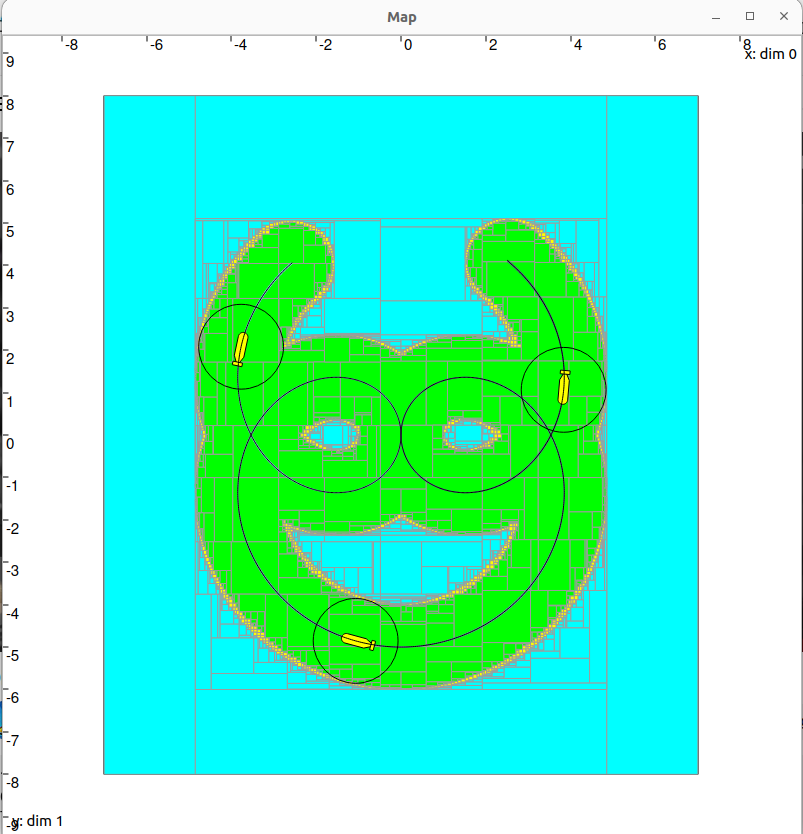

# Codac-Coverage-Toolbox (CCT)

**A C++ toolbox for guaranteed sensor coverage along a robot’s known trajectory using interval analysis and CODAC contractors.**

The **Codac Coverage Toolbox** allows users to compute and visualize the area covered by a robot’s sensor along a **known trajectory** (i.e., no position uncertainty is considered), with a **guaranteed spatial resolution**, while taking into account both:

- **Binary perception logic** (perceived / not perceived)
- **Three-valued perception logic** (perceived / not perceived / uncertain)

This toolbox focuses on:
- **Perception uncertainty**, such as limited sensor range or field-of-view uncertainty
- **Computation uncertainty**, induced by the finite paving resolution

This repository is suitable for:
- Students or researchers studying **guaranteed coverage and interval-based perception** in robotics
- Practitioners who want to **simulate and visualize sensor coverage** along a known trajectory
- Anyone interested in **interval analysis and set-based reasoning** for robotic perception

---

## Table of contents

1. [Illustration](#1-illustration)
2. [Dependencies](#2-dependencies)
   - [2.1 Required Libraries](#21-required-libraries)
   - [2.2 Recommended Components](#22-recommended-components)
3. [Installation](#3-installation)
   - [3.1 Clone the repo (for beginners)](#31-clone-the-repo-for-beginners)
   - [3.2 Recommended `CMakeLists.txt`](#32-recommended-cmakeliststxt)
   - [3.3 Build Instructions](#33-build-instructions)
   - [3.4 Build Time and Runtime Notes](#34-build-time-and-runtime-notes)
   - [3.5 Running an Example](#35-running-an-example)
4. [Project Overview / Toolbox Structure](#4-project-overview--toolbox-structure)
   - [4.1 Repository Structure](#41-repository-structure)
   - [4.2 Contractors](#42-contractors)
   - [4.3 Separators](#43-separators)
   - [4.4 Examples](#44-examples)
5. [Theory and Concepts](#5-theory-and-concepts)
   - [5.1 Intervals and Boxes](#51-intervals-and-boxes)
   - [5.2 Tubes and Trajectories](#52-tubes-and-trajectories)
   - [5.3 Contractors](#53-contractors)
   - [5.4 Separators](#54-separators)
   - [5.5 Projection for Coverage: SepProj and SepDyn*Proj*](#55-projection-for-coverage-sepproj-and-sepdynproj)
   - [5.6 Paving and Set Classification](#56-paving-and-set-classification)

---

## 1. Illustration

Below is an example of sensor coverage computed using the **Codac Coverage Toolbox** with a **binary sensor perception logic**, along a **known trajectory**. This figure is generated from **Example 1** of the `SepDynDiskProj` class.

In this example, the robot is equipped with an **omnidirectional range sensor** mounted on its body:
- At any time `t`, the sensor perception is represented by a **disk** centered at the robot position.
- The disk radius corresponds to the **sensor range**.
- The perception logic is **binary**:
  - Any point inside the disk is considered **perceived**.
  - Any point outside the disk is considered **not perceived**.

The area covered by the sensor along the trajectory corresponds to the **union of all perceived areas** over time.  
  
<div align="center">
  
</div>

**Description of the figure:**

- The **black curve** represents the robot’s known trajectory.
- The **yellow vehicle shapes** show the robot (AUV) position at three different time instants along the trajectory.
- The **black circles** correspond to the sensor perception (range disks) at these selected times.
- The **covered area** is displayed in **green**.
- The **uncovered area** is displayed in **light blue**.
- The **uncertain (unknown) area** is displayed in **yellow**.

**Key points for beginners:**

- Each point in the **green area** is guaranteed to be **inside the sensor coverage**.
- Each point in the **light blue area** is guaranteed to be **outside the sensor coverage**.
- Points in the **yellow area** cannot be classified as inside or outside the sensor coverage due to the **finite paving resolution** used for the computation.

---

## 2. Dependencies

This toolbox relies on several external libraries for interval computation, contractors, separators, linear algebra, and visualization. All of them must be installed prior to building the toolbox.  

### 2.1 Required Libraries


> ⚠️ **Important note about dependencies (please read first)**  
>
> The **CODAC library depends internally on IBEX and Eigen3**.
>  
> This means:
> - You **do NOT need to install IBEX and Eigen3 manually** if you install CODAC following the **official CODAC installation guide**.
> - The CODAC installation procedure **already installs and configures IBEX and Eigen3** correctly.
>
> ✅ **Recommended workflow (strongly advised):**
> 1. Install **CODAC v1** by following the official guide
> 2. If CODAC is detected correctly by CMake, then:
>    - IBEX is installed and working  
>    - Eigen3 is installed and working  
>    - **No additional installation is required for IBEX and Eigen3**

1. **CODAC v1**  
   - Provides the core interval-based contractors, separators, and tube representations used by this toolbox.  
   - Version 1 is required; version 2 is still in development and not yet fully compatible.
   - **(Recommended)** For installation instructions, please ref er to the official guide: [CODAC Installation Guide](https://www.codac.io/install/01-installation.html).

2. **IBEX**  
   - Interval arithmetic library used for handling intervals and interval vectors.  
   - Required version: 2.8.x or later.  
   - **(Not Recommended)** Installation instructions are available on the official website: [IBEX Installation](https://ibex-team.github.io/ibex-lib/install-cmake.html).

3. **Eigen3**  
   - High-performance C++ library for linear algebra, used internally by CODAC and this toolbox.  
   - Required version: 3.4.x or later.  
   - **(Not Recommended)** Installation instructions: [Eigen3 Official Repo](https://libeigen.gitlab.io/).

4. **VIBes**  
   - Visualization library to display trajectories, tubes, and coverage areas.  
   - Required to view the figures generated by the examples.  
   - For installation instructions, please consult: [VIBes Installation Guide](https://github.com/ENSTABretagneRobotics/VIBES).

> **Note:** VIBes is mandatory only for visualization. If you intend to run the toolbox without generating figures, you can skip VIBes, but examples will not display any graphical output.  


### 2.2 Recommended Components

1. **Operating system**
     - Linux (tested on Ubuntu-based distributions)

2. **Compiler and build system**
    - C++17-compatible compiler (e.g., GCC ≥ 9)
    - CMake ≥ 3.12

---

## 3. Installation

### 3.1 Clone the repo (for beginners)

> This subsection is intended **only for Git beginners**. Experienced users can skip this part and clone the repository using their usual workflow.

To use this project, you first need to **download a copy of the repository** on your computer. The recommended way is to use **Git** to clone the latest version of the `main` branch.

1. **Navigate to the folder** where you want to save the project.  
   - For example, you might create a folder called `Projects` in your home directory.
2. **Open a terminal** in that folder.  
   - On most systems, you can right-click in the folder and choose **“Open Terminal”** (or similar).
3. **Run the following commands** in the terminal:

```bash
git clone https://github.com/desnault/Codac-Coverage-Toolbox.git
cd Codac-Coverage-Toolbox
```

### 3.2 Recommended `CMakeLists.txt`

This repository provides a **recommended `CMakeLists.txt`** that was used by the author during development and testing.

It is intended to:
- Serve as a **working reference configuration**
- Help beginners compile the project more easily
- Provide a long-term reminder of a functional build setup (even years later)

⚠️ **Important note**

- This `CMakeLists.txt` may **not work out-of-the-box on every system**
- Paths, compiler versions, and installed libraries can vary
- If compilation fails, users should adapt it according to:
  - Their CODAC installation
  - Their system configuration
  - The official CODAC documentation

Nevertheless, this file should work for **most standard CODAC installations** and is strongly recommended as a starting point.

#### Author’s reference `CMakeLists.txt`

The following `CMakeLists.txt` is the one used to build and test this toolbox:

```cmake
# ==============================================================
# CMakeLists.txt for Codac Coverage Toolbox
# ==============================================================
# This file configures the project, builds the common library
# from contractors and separators, and compiles all example
# scripts into their respective subfolders.
# ==============================================================

cmake_minimum_required(VERSION 3.12)

# Name of the project and the language
project(codac_coverage_toolbox LANGUAGES CXX)

# Use C++17 standard
set(CMAKE_CXX_STANDARD 17)
set(CMAKE_CXX_STANDARD_REQUIRED ON)


# ==============================================================
# ----------- Import external libraries ----------------------
# ==============================================================

# IBEX: library for interval arithmetic
find_package(IBEX REQUIRED)
ibex_init_common()  # initialize IBEX common settings
message(STATUS "Found IBEX version ${IBEX_VERSION}")

# Eigen3: linear algebra library
find_package(Eigen3 REQUIRED NO_MODULE)
message(STATUS "Found Eigen3 version ${Eigen3_VERSION}")

# CODAC: library for contractors, separators, tubes, etc.
find_package(CODAC REQUIRED)
message(STATUS "Found CODAC version ${CODAC_VERSION}")


# ==============================================================
# --------- Compile main library (contractors + separators) -
# ==============================================================

# Gather all source files from contractors folder (*.h and *.cpp)
file(GLOB_RECURSE CONTRACTORS_SOURCES
     CONFIGURE_DEPENDS
     "${CMAKE_SOURCE_DIR}/contractors/*.h"
     "${CMAKE_SOURCE_DIR}/contractors/*.cpp")

# Gather all source files from separators folder (*.h and *.cpp)
file(GLOB_RECURSE SEPARATORS_SOURCES
     CONFIGURE_DEPENDS
     "${CMAKE_SOURCE_DIR}/separators/*.h"
     "${CMAKE_SOURCE_DIR}/separators/*.cpp")

# Combine all sources into a single variable
set(PROJECT_SOURCES ${CONTRACTORS_SOURCES} ${SEPARATORS_SOURCES})

# Create a static library from all sources
# This library will be linked to all examples
add_library(interval_coverage_lib STATIC ${PROJECT_SOURCES})

# Include directories for this library
# This allows #include "header.h" to work in your source files
target_include_directories(interval_coverage_lib PUBLIC
    ${CMAKE_SOURCE_DIR}/contractors
    ${CMAKE_SOURCE_DIR}/separators
    ${IBEX_INCLUDE_DIRS}
    ${EIGEN3_INCLUDE_DIRS}
    ${CODAC_INCLUDE_DIRS}
)

# Apply CODAC-specific compiler options
target_compile_options(interval_coverage_lib PUBLIC ${CODAC_CXX_FLAGS})

# Link external libraries (CODAC + IBEX) to the library
target_link_libraries(interval_coverage_lib PUBLIC ${CODAC_LIBRARIES} Ibex::ibex)


# ==============================================================
# ---------------- Compile examples --------------------------
# ==============================================================

# Gather all example scripts (*.cpp) recursively
# Each subfolder under examples corresponds to a category
file(GLOB_RECURSE EXAMPLE_SOURCES
     CONFIGURE_DEPENDS
     "${CMAKE_SOURCE_DIR}/examples/*/*.cpp")

# Loop over each example script
foreach(example_src IN LISTS EXAMPLE_SOURCES)

    # Compute relative path from examples folder
    file(RELATIVE_PATH rel_path "${CMAKE_SOURCE_DIR}/examples" "${example_src}")
    
    # Extract filename without extension
    get_filename_component(example_name ${rel_path} NAME_WE)
    
    # Extract the subfolder name (example category)
    get_filename_component(example_dir ${rel_path} DIRECTORY)

    # Create a unique target name to avoid conflicts
    string(REPLACE "/" "_" target_name "${example_dir}_${example_name}")

    # Create the executable for this example
    add_executable(${target_name} ${example_src})

    # Link the main library to the executable
    target_link_libraries(${target_name} PRIVATE interval_coverage_lib)

    # Include directories for this target
    target_include_directories(${target_name} PRIVATE
        ${CMAKE_SOURCE_DIR}/contractors
        ${CMAKE_SOURCE_DIR}/separators
    )

    # Apply CODAC-specific compiler options
    target_compile_options(${target_name} PRIVATE ${CODAC_CXX_FLAGS})

    # Include directories for system libraries (CODAC, IBEX, Eigen, GAOL)
    target_include_directories(${target_name} SYSTEM PRIVATE
        ${CODAC_INCLUDE_DIRS}
        ${IBEX_INCLUDE_DIRS}
        ${EIGEN3_INCLUDE_DIRS}
    )

    # Define output directory for the executable
    # It will follow the subfolder structure of examples
    set(output_dir "${CMAKE_BINARY_DIR}/examples/${example_dir}")
    file(MAKE_DIRECTORY ${output_dir})  # ensure directory exists

    # Set target properties: executable name and output directory
    set_target_properties(${target_name} PROPERTIES
        OUTPUT_NAME "${example_name}"              # keep the executable name same as the .cpp file
        RUNTIME_OUTPUT_DIRECTORY "${output_dir}"   # store executable in the build subfolder
    )

endforeach()
```

### 3.3 Build Instructions

Place the `CMakeLists.txt` file at the root of the repository and run the following commands (still from the root):

```bash
mkdir build
cd build
cmake ..
make
cd ..
```

This procedure will:

- Configure the project using CMake
- Compile a static library containing:
   - All contractors
   - All separators
- Compile all example programs located in the `examples/` directory
- Place each executable in a corresponding subfolder under: `build/examples/`

During compilation, you should see messages similar to:

```bash
-- Using CMake 3.22.1
-- C++ compiler: GNU 11.4.0
-- Will build static libraries
-- Found IBEX version 2.8.9.20250626
-- Found Eigen3 version 3.4.0
-- Found CODAC version 1.5.6
```

These messages confirm that:

- CMake detected a suitable compiler
- CODAC (v1), IBEX, and Eigen were found correctly
- The project is configured as expected

If a dependency is not detected:

- Do **not** modify the toolbox source code to fix missing dependencies
- Instead, adapt your local CMake configuration or installation paths, or refer to the official installation guide of the missing library

### 3.4 Build Time and Runtime Notes

#### Compilation time

Compiling the full project (library + all examples) may take **more than 1 minute** on a standard development PC.

#### Runtime considerations

Many examples rely on **paving-based set inversion** to compute **guaranteed coverage areas**.

Runtime depends strongly on:
- the **paving resolution**
- the **size of the area** to pave

> ⚠️ Fine paving resolutions can significantly increase computation time.

> ⏳ Generating figures for the coverage examples can also take time.


### 3.5 Running an Example

After compilation, example executables can be run directly from the `root` directory.

Example:

```bash
./build/examples/SepDynDiskProj/example1_covered_area_binary_range
```

This will:
- Display the covered area along the trajectory
- Show the robot trajectory and sensor perception at selected times

> ⚠️ Do not forget to run vibes viewer to see the figure generated by the example.

---

## 4. Project Overview / Toolbox Structure

### 4.1 Repository Structure

The repository is organized as follows:

```bash
├── contractors # Core contractors used for interval-based reasoning
│   ├── CtcDynDist.cpp
│   ├── CtcDynDist.h
│   └── ...
│
├── separators # Separators that combine contractors and projection logic
│   ├── SepDynDisk.cpp
│   ├── SepDynDisk.h
│   └── ...
│
├── examples # Example programs demonstrating coverage computation
│   ├── CtcDynDist # Examples for class CtcDynDist
│   ├── CtcDynPolar # Examples for class CtcDynPolar
│   └── ...
│
├── LICENSE
└── README.md
```

### 4.2 Contractors

The `contractors/` folder contains **core contractors** used for interval-based reasoning. Contractors are low-level classes that perform **contraction on interval variables** based on constraints.

**Available contractors:**

- **CtcDynDist**: Definition of a dynamic Euclidean distance contractor
- **CtcDynPolar**: Definition of a dynamic Polar contractor

> **Note:** For more details about each contractor, see the **top comments in the corresponding header files** in `contractors/`.

### 4.3 Separators

The `separators/` folder contains **high-level classes** that combine contractors with **projection and sensor coverage logic**. Separators generally **wrap one or more contractors** and implement **projection of the sensor’s perception over time**.  

**Available separators:**

- **SepDynDistProj**  
  - Computes coverage based on **distance constraints** along a known trajectory.  
  - Can handle **binary** or **uncertain (three-valued) perception logic**.  
  - Useful for abstract distance-based sensors.

- **SepDynDiskProj**  
  - Projects a **disk-shaped sensor coverage** along a trajectory.  
  - Supports **binary** and **uncertain perception**.  
  - Ideal for **omnidirectional range sensors** (e.g., sonar or LIDAR with circular coverage).

- **SepDynPolarProj**  
  - Projects an **oriented sensor coverage** based on **distance constraints**.  
  - Can handle **binary perception** (inside/outside the FOV) and angle wrap-around.  
  - Suitable for **forward-looking directional sensors** with limited angular FOV.

- **SepDynPieProj**  
  - Projects a **pie-shaped directional sensor** along a trajectory.  
  - Supports **binary** and **three-valued perception logic**.  
  - Useful for **sonar, cameras, or directional sensors** where detection is not isotropic.  

- **SepDynDist**  
  - Computes **distance-based constraints** without projection along time.  
  - Mainly used by **advanced users** for specialized distance-based reasoning.

- **SepDynDisk**  
  - Computes **disk-shaped constraints** without temporal projection.  
  - Advanced usage for experiments with single-time coverage evaluation.

- **SepDynPolar**  
  - Computes **directional polar constraints** without temporal projection.  
  - Used internally by **SepDynPolarProj**, rarely needed by beginners.

- **SepDynPie**  
  - Computes **pie-shaped constraints** without temporal projection.  
  - Used internally by **SepDynPieProj**, mainly for advanced users or testing.

> **Guidance for beginners:**  
> - Start with the **Proj separators** (`SepDynDiskProj`, `SepDynPieProj`, `SepDynDistProj`) using **Example 1** with binary perception.  
> - These classes encapsulate all necessary logic for coverage along a known trajectory.  
> - For **custom or advanced computations**, you can combine the low-level contractors directly.

> **Note:** For more details about each separator, see the **top comments in the corresponding header files** in `separators/`.

### 4.4 Examples

The `examples/` folder contains **ready-to-run C++ programs** demonstrating coverage computations using the separators.

**Best examples for beginners:**


- `SepDynDiskProj/example1_covered_area_binary_range.cpp`
  - Shows a **disk-shaped sensor** with **binary perception logic**.
  - Recommended as the first example to run.

- `SepDynPieProj/example1_covered_area_binary_perception.cpp`
  - Shows a **pie-shaped directional sensor** with **binary perception logic**.

- `SepDynDistProj/example1_covered_area_interval_range.cpp`
  - Shows a **distance-based coverage** example with **binary perception logic**.

> **Note:** Each example folder also contains a **`.png` image** showing the expected output. Users can use these images to verify that their installation and build are working correctly.

---

## 5. Theory and Concepts

This section introduces the key theoretical concepts behind the Codac Coverage Toolbox, focusing on the constructs from the **CODAC library** that are used for guaranteed coverage computation. These include **intervals**, **tubes and trajectories**, **contractors**, **separators**, and **projection for coverage over time**.

The explanations here are deliberately high‑level and beginner‑friendly. For more detailed descriptions and formal definitions, consult the official CODAC documentation and the top comments in the corresponding header files in the repository.

### 5.1 Intervals and Boxes

At the heart of the CODAC library are **intervals**, which represent closed sets of real numbers `[a, b]`, and **boxes** (IntervalVectors), which represent Cartesian products of intervals.

- An **Interval** `[a,b]` encloses all real values between `a` and `b`.
- An **IntervalVector** represents a multidimensional box, defined as the product of intervals for each dimension.

These constructs allow CODAC to represent **sets of possible values** instead of single point estimates, which is critical for guaranteeing that all possible solutions are accounted for.

### 5.2 Tubes and Trajectories

For dynamic systems, CODAC introduces **tubes**, which are extensions of intervals to functions of time.

- A **Tube** is an envelope of (potentially many) real trajectories over a time domain `[t0, tf]`: at each time `t`, a tube gives an interval that contains the value(s) of a function at that time.  
- A **TubeVector** extends this concept to vectors of tube components, representing multi‑dimensional time‑varying states.  
- A **TrajectoryVector** is a time‑parameterized vector of known (nominal) functions, typically representing the robot’s trajectory.

Tubes are implemented as lists of slices, each covering a small time interval, and can enclose all feasible dynamic behaviors within given bounds.

### 5.3 Contractors

**Contractors** are the fundamental operators in CODAC’s constraint programming paradigm. A contractor is an operator that contracts a set without losing any feasible solution.

Given a domain (interval, box, or tube), a contractor reduces this domain by removing values that **cannot satisfy a constraint**.

- For example, a distance constraint contractor will narrow the domains of variables so they satisfy a specified range or geometric relationship.
- Contractors act on intervals and tubes, contracting them in place.

Contractors are used to propagate constraints throughout a problem and are the building blocks for separators.

**Important note:** In this toolbox we generally do **not use contractors directly**; instead we wrap them inside separators for projection and coverage tasks.

### 5.4 Separators

A **separator** is a higher‑level construct built from one or more contractors.  
It is designed to classify sets into three categories relative to a target set `S`:

- Points that are **certainly inside** `S`
- Points that are **certainly outside** `S`
- Points that are **unknown/uncertain**

Formally, a separator `S` acting on a box `[x]` outputs two sub‑boxes:
- `[x_in]`, which contains points that must be in `S`
- `[x_out]`, which contains points that must be outside `S`

A separator can be viewed as a **pair of complementary contractors** used to perform set classification. Separators can also be combined and used with set inversion algorithms such as CODAC’s `SIVIA` method (used for paving/exploration).

In this toolbox, separators are used to determine which regions of the workspace are covered, uncovered, or uncertain with respect to sensor perception constraints.


### 5.5 Projection for Coverage: SepProj and SepDyn*Proj*

A core task of coverage computation is to **project a time‑varying perception constraint over a time domain**.  
To do this, CODAC provides a generic operator called **SepProj**, which projects a separator over time to account for dynamic effects.

The high‑level wrapper classes in this toolbox (e.g., `SepDynDistProj`, `SepDynDiskProj`, `SepDynPolarProj`, `SepDynPieProj`) combine:

1. A **dynamic separator** (e.g., one that encodes a time‑dependent geometric constraint)
2. The **SepProj projection operator**, which integrates the separator over a time interval

The result is a **projected separator** that classifies points in the environment as:
- **covered** (inside perception for at least one time `t`)
- **uncovered** (never inside perception at any time)
- **uncertain** (cannot be classified due to computation resolution)

This projection over time is the basis for computing global coverage along a **known trajectory**, which is the main goal of the Codac Coverage Toolbox.


### 5.6 Paving and Set Classification

To compute and visualize coverage maps, this toolbox uses a **paving algorithm** invoked through CODAC’s `SIVIA` function.  

Although `SIVIA` in CODAC is formally a **set inversion method**, it can be used to produce a **paving** of the workspace — classifying regions according to coverage status.

- Green regions typically represent **inside/covered**
- Blue regions represent **outside/uncovered**
- Yellow regions represent **uncertain**

SIVIA recursively subdivides initial boxes and refines the classification using separators until a specified resolution is reached.  
This process yields a set of boxes approximating the coverage area with formal guarantees.

> ⚠️ The term “paving” is used here for clarity; in CODAC the method used to trigger subdivision and classification is `SIVIA`, which ultimately performs set inversion via separators.

> **Note:** For full mathematical definitions and API details, refer to the official CODAC manual and the top‑of‑file comments in the relevant header files.


